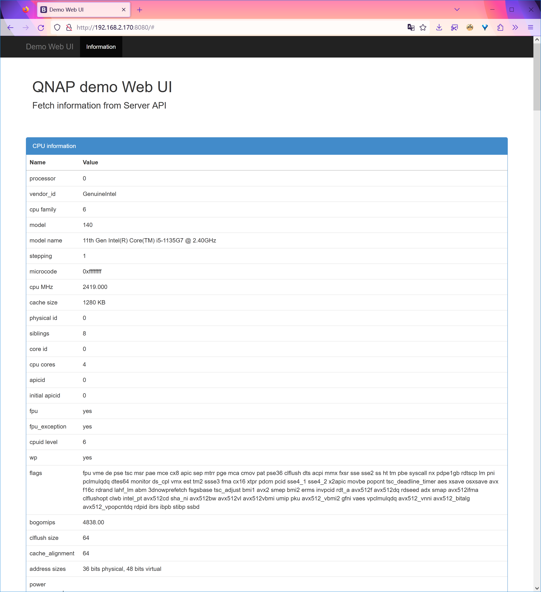

# HTTP SERVER DEMO

> This is a very simple HTTP server

AUTHOR: Abhijeet Rastogi (http://www.google.com/profiles/abhijeet.1989)

This is a very simple HTTP server. Default port is 10000 and ROOT for the server is your current working directory..

## arguments
You can provide command line arguments like:- $./a.aout -p [port] -r [path]

## example
```
$./a.out -p 50000 -r /home/
to start a server at port 50000 with root directory as "/home"

$./a.out -r /home/shadyabhi
starts the server at port 10000 with ROOT as /home/shadyabhi
```
